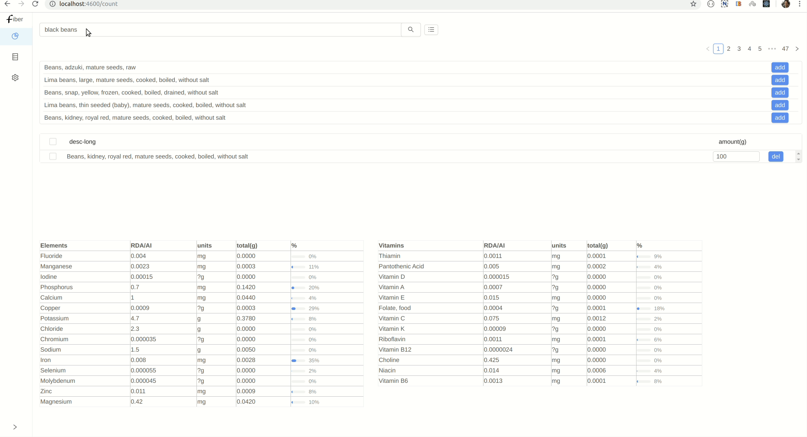
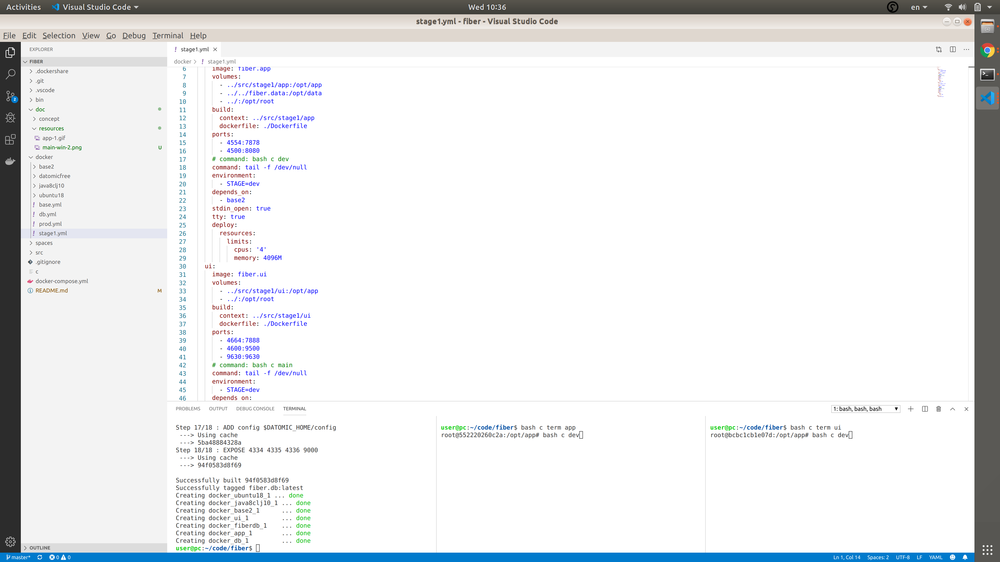
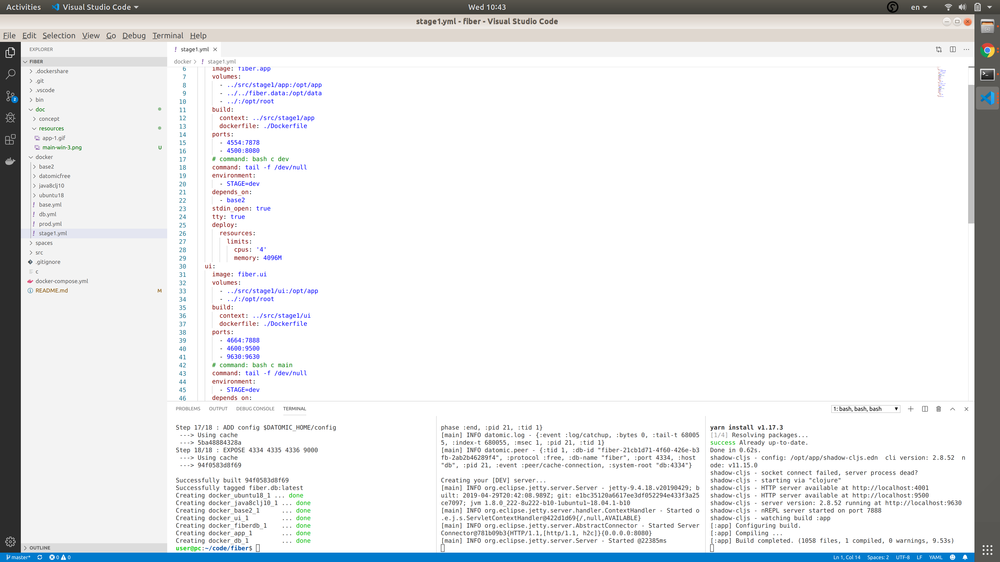
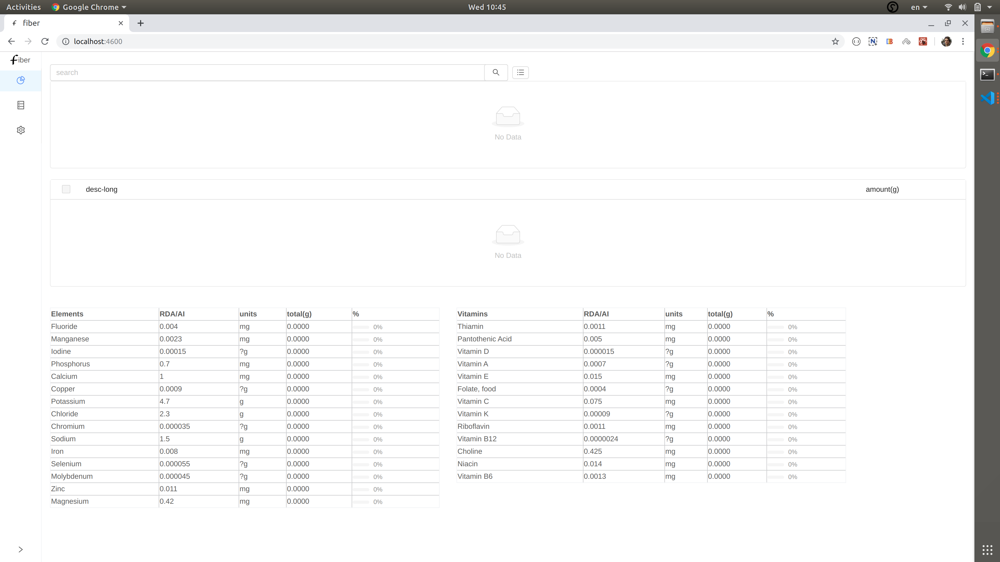

# fiber

food metrics app</br>

<div align="center">
  <a href="./doc/resources/app-1.gif?raw=true">
  </img>
  </a>
</div>


- [concept](./doc/concept/concept.md)
- [run](#run)
- [develop](#develop)
- [resources](#resources)
- [etc](#etc)

## run 

- using [docker-compose.yml](./docker-compose.yml)

```bash

# clone repo
git clone https://github.com/seeris/fiber
cd fiber

# start containers
docker-compose up -d 

# follow logs (the first time it will take 5-10 mins to populate db)
docker-compose logs -f app

# stop,remove containers
docker-compose down

# remove db 
docker volume rm fiber.db

```

## develop

#### start

- using [.yml files](./docker/)

```bash

# clone repo
git clone https://github.com/seeris/fiber
cd fiber

# start containers
bash c up

# start app (separate terminal)
bash c term app
bash c dev 

# start ui (separate terminal)
bash c term ui
bash c dev 

```
<div align="left">
  <a href="./doc/resources/main-win-3.png?raw=true">
  </img>
  </a>
  <a href="./doc/resources/main-win-4.png?raw=true">
  </img>
  </a>
   <a href="./doc/resources/ui-1.png?raw=true">
  </img>
  </a>
</div>

```bash

# stop, remove containers
bash c down

```

#### REPL

- app REPL port `4554` 
- ui REPL port `4664` (shadow-cljs)

#### spaces

- [consider using](https://seeris.github.io/posts-output/2019-09-18-symlink-workspaces-vscode) 
  `spaces/cln` `spaces/srv` with VSCode

## resources

- data for the `fiber` app is stored in [fiber.data](https://github.com/seeris/fiber.data) repo

## etc

#### stack

- [clj](https://clojure.org)
- [cljs](https://clojurescript.org/)
- [datomic](https://www.datomic.com/on-prem.html)
- [docker](https://www.docker.com/)
- [shadow-cljs](https://github.com/thheller/shadow-cljs)
- [clj deps](https://clojure.org/reference/deps_and_cli)
- [re-frame](https://github.com/Day8/re-frame)
- [antd](https://github.com/ant-design/ant-design)


