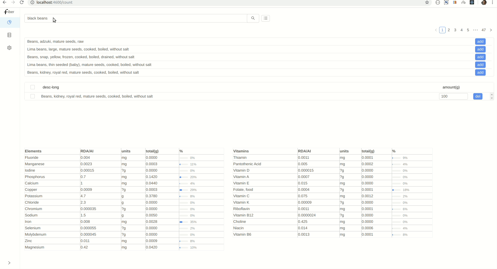

# playground.fiber

food metrics app</br>

status: primordial

#### [stage 1:](./doc/concept/concept.md#stage-1-mwp)

<div align="center">
  <a href="./doc/resources/stage-1.gif?raw=true">
  </img>
  </a>
</div>

## dev

```bash

# clone repo and data repo
git clone https://github.com/seeris/playground.fiber
git clone https://github.com/seeris/playground.fiber.data

cd playground.fiber

# start containers
bash f up

# start app (separate terminal)
bash f term app
bash f dev 

# in app/setup.clj evaluate (upload-data!) to populate db

# start ui (separate terminal)
bash f term ui
bash f dev 

# ui on http://localhost:4600/

# stop, remove containers
bash f down

```

- app REPL `7788` 
- ui REPL  `8899`

## resources

- data is stored in https://github.com/seeris/playground.fiber.data
- using `spaces` for dev https://seeris.github.io/posts-output/2019-09-18-symlink-workspaces-vscode


