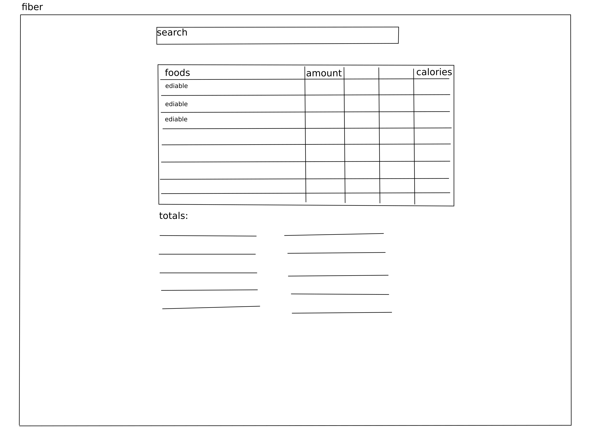

# fiber: food app

## content

- [concept](#concept)
- [stages](#stages)
- [stage 1](#stage-1)

## concept

## stages

#### stage 1: mwp 

<a>
</img>
</a>

* accelerate, make minimal working product
* users can:
    - search, select food items
    - see aggregate values

#### stage 2: design

* design minimal viable product

#### stage 3: mvp

* implement mvp

## stage 1

#### outline

* create a repo for data `fiber.data`
* link repo via symlink
* prepare .edn dataset
* make schema, load data
* try search
* add ui (pick a library other than antd)

* release via docker hub

#### resources

* usda datasets
    - https://github.com/awesomedata/awesome-public-datasets#agriculture

* 